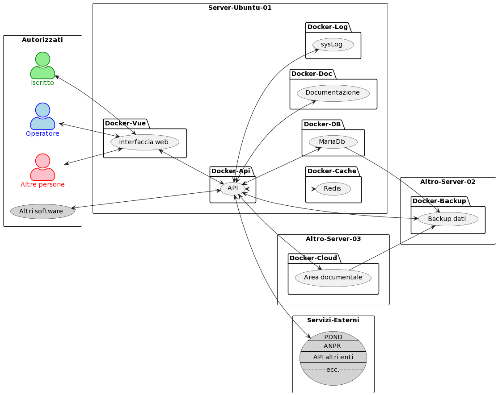
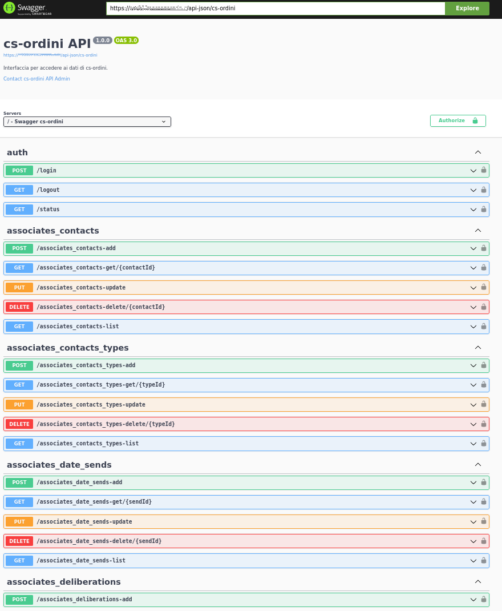

## Architettura dell'Applicazione
Seppur ampliamente adattabile a differenti piattaforme e strutture il programma è basato su Ubuntu Server 22.04, piattaforma docker per separare le differenti componenti, software opensource di terze parti, API in php framework Phalcon, interfaccia in Vue per la migliore UX (User Experience)

Ecco un'immagine che rappresenta l'architettura di cs-ordini:

## API per l'Integrazione Esterna
Il cuore principale della piattaforma è il docker API che oltre ad incaricarsi delle autorizzazioni si fa carico di coordinare l'accesso ai dati tanto per gli utenti quanto per eventuali software di terze parti.
Vi sono 2 modalità per accedere alle API.
- tramite token fornito dalla piattaforma nell'area riservata.
- tramite servizio di autorizzazione mezzo voucher esterni (solo ad esempio PDND) per le API che sono state rese pubbliche.

Per la prima ipotesi si puà trovare la documentazione completa delle API nella sottocartella /swagger/ del docker delle API
Ecco un'immagine di esempio:

Per il collegamento tramite PDND fare riferimento al portale dedicato:
[https://innovazione.gov.it/progetti/dati-e-interoperabilita/](https://innovazione.gov.it/progetti/dati-e-interoperabilita/)

## Contribuire

Se desideri contribuire alla documentazione, segui le linee guida descritte nella [guida per i contributori](CONTRIBUTING.md).

## Segnalazione di Problemi

Per segnalare problemi o suggerimenti specifici alla documentazione, ti preghiamo di aprire una [issue](https://github.com/customsoft/cs-ordini-doc/issues) su questo repository.

## Licenza

Questo progetto è rilasciato con licenza [GNU Affero General Public License](LICENSE.md).

---

[Documentazione Online](https://github.com/customsoft/cs-ordini-doc/docs/index.md) | [Repository del Codice](https://github.com/customsoft/cs-ordini-doc)
